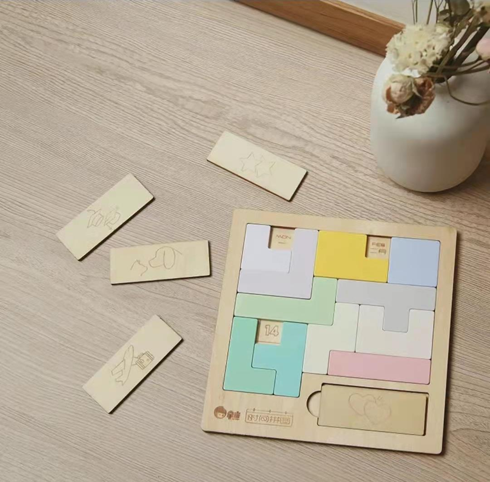

# A solution of the Date Puzzle

This repository deal with the puzzle as follow:

Here is a sepecial kind of Jigsaw Puzzle. In the puzzle, you have several kinds of piece to fill the map. The pieces get three blocks less than the map size, therefore it will be three blank blocks when you fill up all the pieces. Every single block is written a word in the map except the one at top-left. And the words contain Januery-December, 1st-31st, and Sunday-Saturday. So three blocks can match the date when you try to solve the puzzle. It's like this:

The algorithm in this repository to solve this problem is DSF(Depth First Search). The program allow user select one of these mode:

1. Compute one solution for a user specified situation.
2. Compute all combination for date and weekday, try to find one situation that has none solution. (In another word, checking out if all situations get the solution).
